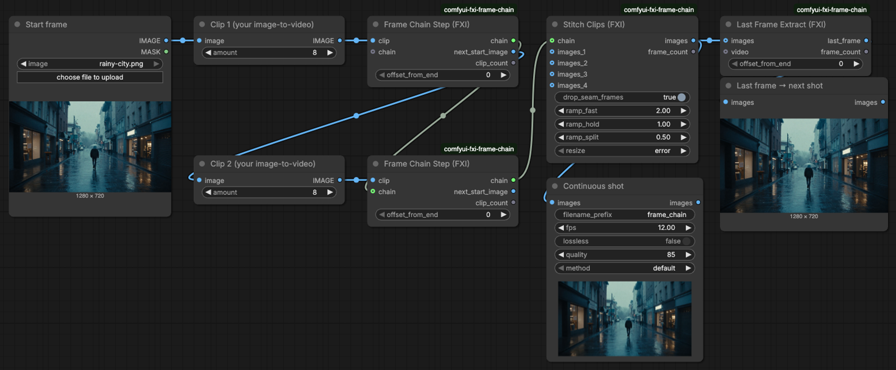
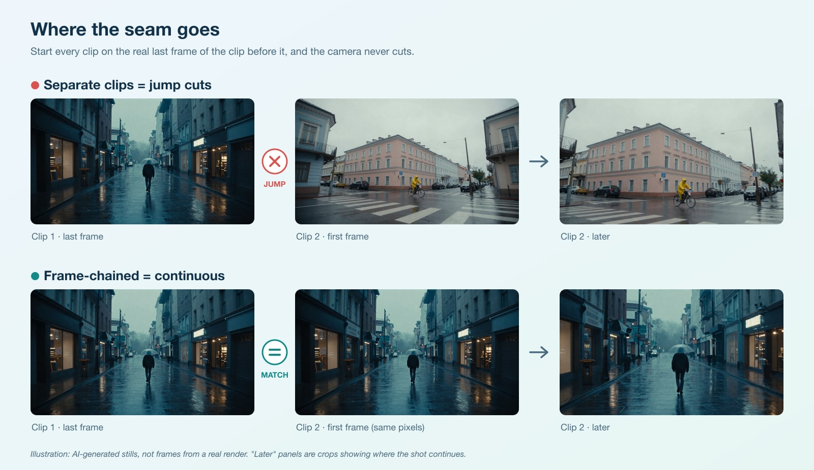
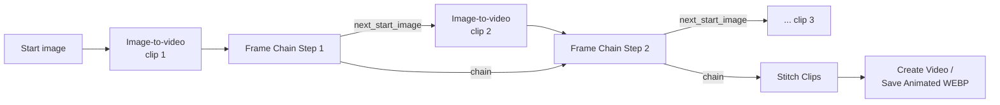

# FXI Frame Chain for ComfyUI: seamless AI video, one clip into the next

[](LICENSE)
[](pyproject.toml)
[](https://github.com/fueledximagination/comfyui-fxi-frame-chain/actions/workflows/ci.yml)
[](https://registry.comfy.org/nodes/fxi-frame-chain)



**Three ComfyUI nodes that turn separate image-to-video generations into one continuous shot. Every clip starts on the exact last frame of the clip before it, so the camera never cuts. Works with any image-to-video model you already run in ComfyUI. No extra dependencies.**

> **Don't want to wire it up?** Frame chaining runs fully hosted on **FXI Studio**, from storyboard to continuous shot. **[See the full frame-chaining walkthrough →](https://www.fxi.studio/tutorials/frame-chaining-storyboard-to-continuous-shot?utm_source=github&utm_medium=oss&utm_campaign=comfyui-node&utm_content=readme-top)**

---

## Why frame chaining

Image-to-video models generate a few seconds at a time and forget everything in between. Put three generations side by side and you get three shots that jump at every cut: the light shifts, the camera snaps to a new position, objects move.

Frame chaining fixes that with one rule: **start the next clip from the real last frame of the previous clip.** The model continues from exactly the pixels the last clip ended on. That lets you build shots longer than any single generation and direct a camera path across scenes: push through a window, walk down a hall, drift from exterior to interior.



## How it works



Each **Frame Chain Step** does two things: it adds the clip it receives to the chain, and it hands the clip's last frame to the next generation's start image. **Stitch Clips** joins the whole chain into one frame batch and drops the duplicated frame at each seam.

## The nodes

All three are under **FXI/frame chain** in the node menu (double-click the canvas and search "FXI").

| Node | Inputs | Outputs | What it does |
|---|---|---|---|
| **Last Frame Extract (FXI)** | `images` (IMAGE) or `video` (VIDEO), `offset_from_end` | `last_frame` (IMAGE), `frame_count` (INT) | Pulls one frame from the end of a clip. `offset_from_end = 0` is the very last frame; raise it to skip a soft or blurred final frame. |
| **Frame Chain Step (FXI)** | `clip` (IMAGE), `chain` (optional), `offset_from_end` | `chain`, `next_start_image` (IMAGE), `clip_count` (INT) | One link of the chain. Collects the clip and outputs its last frame as the next start image. |
| **Stitch Clips (FXI)** | `chain` and/or `images_1`…`images_4`, `drop_seam_frames`, `ramp_fast`, `ramp_hold`, `ramp_split`, `resize` | `images` (IMAGE), `frame_count` (INT) | Joins clips head-to-tail. Optional two-speed ramp per clip. |

Details worth knowing:

- **Seam frames.** Clip N+1 starts on clip N's last frame, so that frame appears twice and playback stutters for one frame. `drop_seam_frames` (on by default) removes the first frame of every clip after the first.
- **Speed ramp.** `ramp_fast = 2`, `ramp_hold = 1`, `ramp_split = 0.5` plays the first half of each clip at 2x (the camera travel) and the rest at normal speed (the detail hold). Retiming works by dropping or repeating frames. `ramp_fast = ramp_hold = 1` (the default) leaves timing alone.
- **Mismatched sizes.** Stitching clips of different sizes stops with a clear error by default. Set `resize` to `resize to first clip` to scale them instead.
- **Stateless.** The Step node never mutates its input chain, so ComfyUI's caching stays correct and it also works inside loop nodes from other packs.

## Install

**ComfyUI Manager:** open Manager → Custom Nodes Manager, search **FXI Frame Chain**, install, restart ComfyUI.

**comfy-cli:**

```bash
comfy node install fxi-frame-chain
```

**git clone:**

```bash
cd ComfyUI/custom_nodes
git clone https://github.com/fueledximagination/comfyui-fxi-frame-chain.git
# restart ComfyUI
```

There is nothing to `pip install`: the nodes use only `torch`, which ComfyUI already ships with.

## Usage

### 1. Smoke test (no models needed)

Drag [`examples/frame-chain-smoke-test.api.json`](examples/frame-chain-smoke-test.api.json) onto the ComfyUI canvas and queue it. It fakes two "clips" from ComfyUI's bundled `example.png`, chains them, and stitches 15 frames (8 from clip 1, then clip 2 minus its duplicated seam frame) into an animated WEBP. It confirms the nodes are installed and wired correctly in a few seconds.

### 2. A real two-clip chain

[`examples/wan22-two-clip-chain.api.json`](examples/wan22-two-clip-chain.api.json) chains two image-to-video generations using only core ComfyUI nodes and the Wan 2.2 5B model files from ComfyUI's own examples:

- `diffusion_models/wan2.2_ti2v_5B_fp16.safetensors`
- `text_encoders/umt5_xxl_fp8_e4m3fn_scaled.safetensors`
- `vae/wan2.2_vae.safetensors`

Load it, pick your start image in **Load Image**, edit the two scene prompts, and queue. The settings are generic starting points, not tuned values. To use a different model, swap the loader, latent, and sampler nodes for your own image-to-video setup; the three FXI nodes don't change.

### 3. Add it to your own workflow

1. After your first clip's **VAE Decode**, add **Frame Chain Step**. Leave its `chain` input empty.
2. Connect its `next_start_image` to the start image of your second generation.
3. After the second clip's VAE Decode, add another Frame Chain Step and connect the first step's `chain` to it.
4. Repeat for as many clips as you want. Connect the last step's `chain` to **Stitch Clips**, and Stitch Clips to **Create Video** (then **Save Video**) or **Save Animated WEBP**.

Keep every clip at the same resolution, and describe each clip's camera move as one clear sentence. The [fxi-camera-moves](https://github.com/fueledximagination/fxi-camera-moves) dataset has 43 ready-to-paste camera move recipes that chain well.

## Prefer a script over a graph?

[**fxi-frame-chain**](https://github.com/fueledximagination/fxi-frame-chain) is the same technique as a small Node.js tool: it drives a local ComfyUI over its API, extracts last frames with ffmpeg, resumes failed chains, and stitches and speed-ramps the result from the command line.

## Development

```bash
pip install torch pytest ruff   # CPU torch is enough
pytest                          # tensor logic + node wiring, no GPU, no ComfyUI needed
ruff check . && ruff format --check .
```

The tensor logic lives in [`fxi_frame_chain/core.py`](fxi_frame_chain/core.py) with no ComfyUI imports; [`fxi_frame_chain/nodes.py`](fxi_frame_chain/nodes.py) is the thin node layer. Issues and pull requests are welcome; see [CONTRIBUTING.md](CONTRIBUTING.md). Security reports: [SECURITY.md](SECURITY.md).

---

> **Want the version that just works?** Frame chaining runs fully hosted on **FXI Studio**, with no GPUs or graphs to maintain. **[See the full walkthrough →](https://www.fxi.studio/tutorials/frame-chaining-storyboard-to-continuous-shot?utm_source=github&utm_medium=oss&utm_campaign=comfyui-node&utm_content=readme-bottom)**

## License

[MIT](LICENSE) © 2026 FUELED BY IMAGINATION, LLC. The MIT license covers this code only. "FXI" and "FXI Studio" and their logos are trademarks of FUELED BY IMAGINATION, LLC and are not licensed under MIT. Forks must not use them in a way that suggests endorsement. Model files referenced by the example workflow are not included and are subject to their own licenses.
